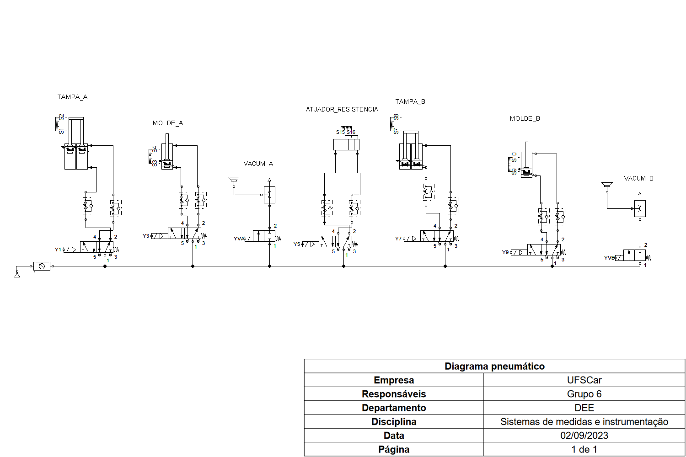
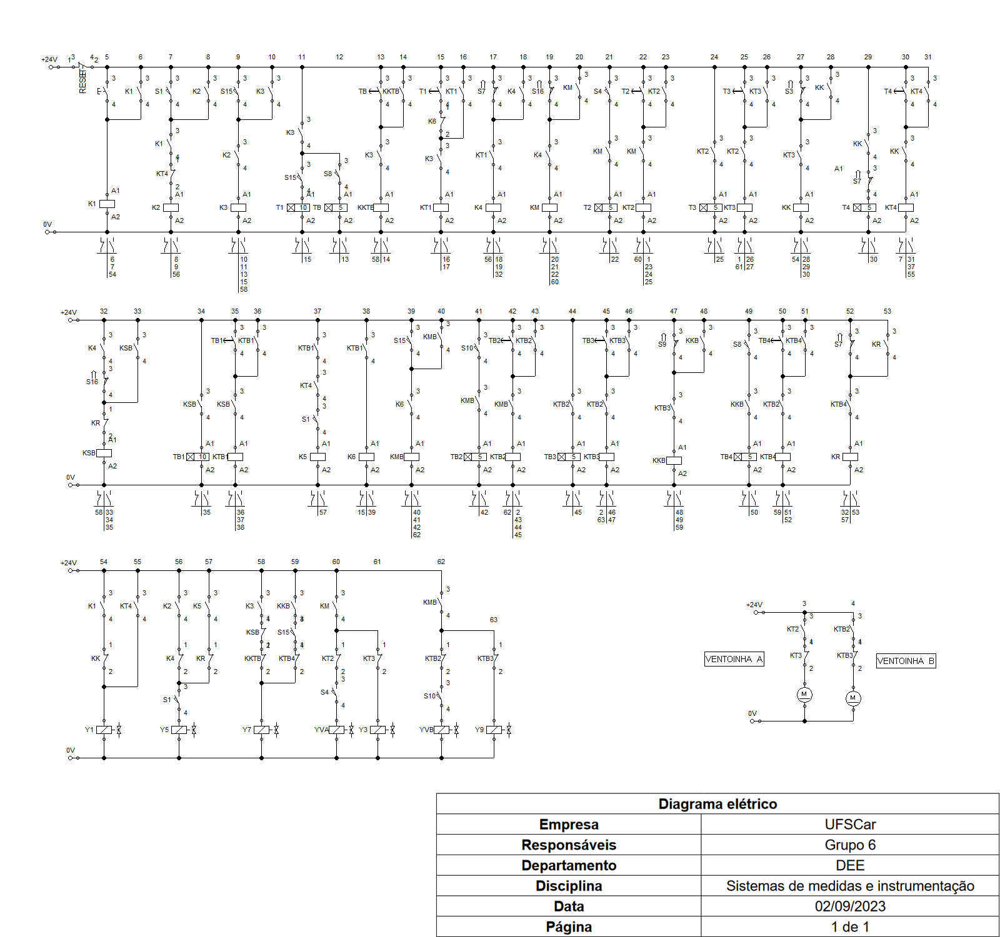
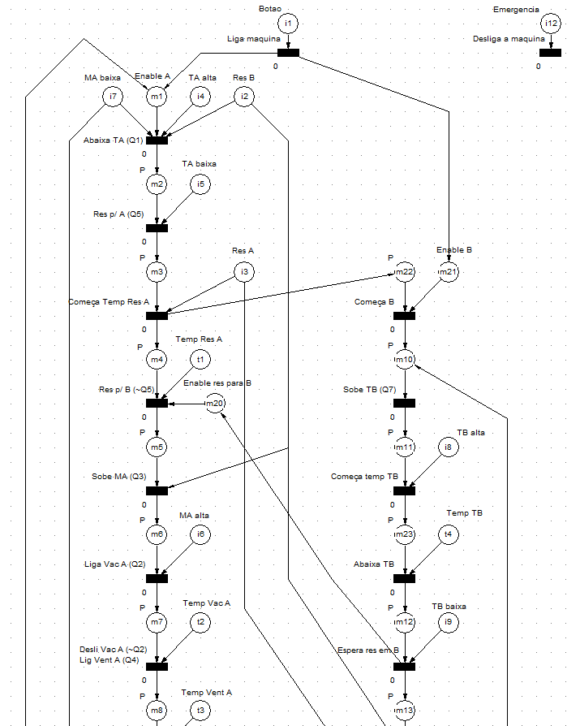
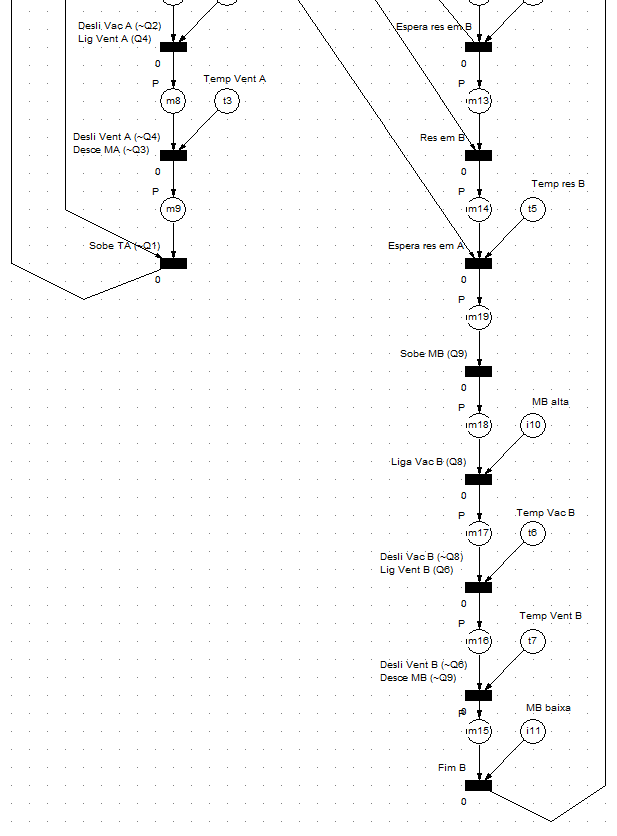

# Vacuum Form
Projeto de uma máquina Vacuum Form pneumática implementada em CLP, redes de Petri e simulada usando FLUIDSIM.
O projeto completo foi desenvolvido em duas matérias separadamente. Inicialmente foi desenvolvido o controle da máquina usando CLP e simulado usando FLUIDSIM e CLIC02 Edit V3, já na segunda matéria o projeto em CLP foi recriado usando redes de Petri.

## Parte I: Controle usando CLP e simulação com FLUIDSIM.

Figura 1 - Diagrama pneumático implementado no FLUIDSIM

Figura 2 - Diagrama elétrico implementado no FLUIDSIM

### Video demo e arquivo Ladder
O programa Ladder correspondente a esta primeira parte está sob o nome de "<a href="vacuum.cli" class="image fit">vacuum.cli</a>".
Um video demonstrativo onde eu realizo a simulação passo-a-passo paralelamente no FLUIDSIM e no CLP usando CLIC02 pode ser visto <a href="https://youtu.be/IMl6Pktmg3c" class="image fit">aqui</a>.

Além disso tem-se a monografia final em "<a href="Monografia_vacuum_forming.pdf" class="image fit">Monografia_vacuum_forming.pdf</a>".

## Parte II: Redes de Petri e recriação da programação ladder.
Nessa segunda parte é explorada uma metodologia algoritimica para implementação de programação ladder, chamada redes de Petri. A rede de Petri desenvolvida para a máquina de vacuum form são exibidas pelas Figuras 3 e 4.

Figura 3 - Rede de petri, parte 1

Figura 3 - Rede de petri, parte 2

### Video demo e arquivo Ladder
Para essa segunda parte, o programa Ladder correspondente a esta primeira parte está sob o nome de "<a href="petri_vacuum.cli" class="image fit">petri_vacuum.cli</a>".
Um video demonstrativo onde eu realizo a simulação passo-a-passo paralelamente usando rede de Petri e CLP pode ser visto <a href="https://youtu.be/44_yE9WLrB4" class="image fit">aqui</a>.

Além disso tem-se a monografia final em "<a href="Monografia_redes_petri.pdf" class="image fit">Monografia_redes_petri.pdf</a>".
